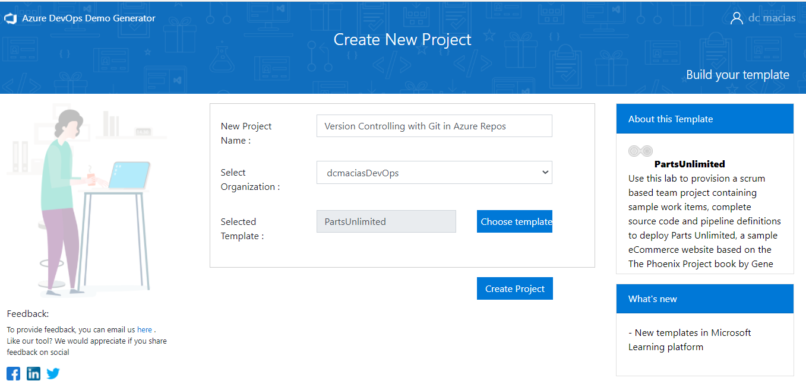
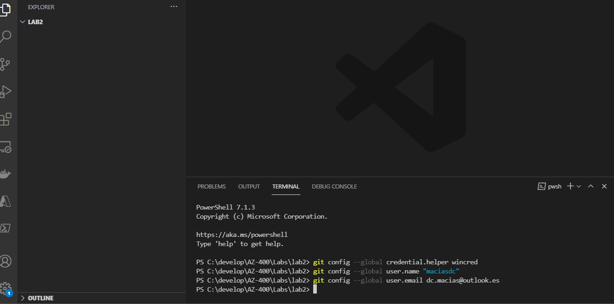
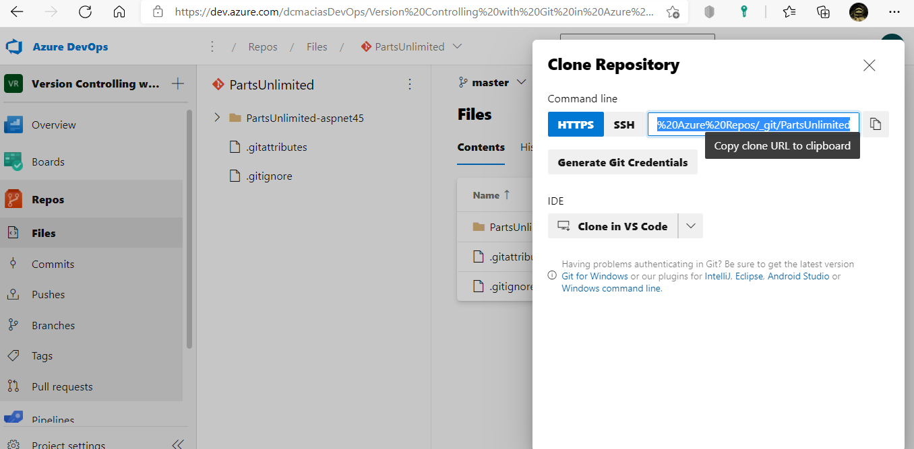
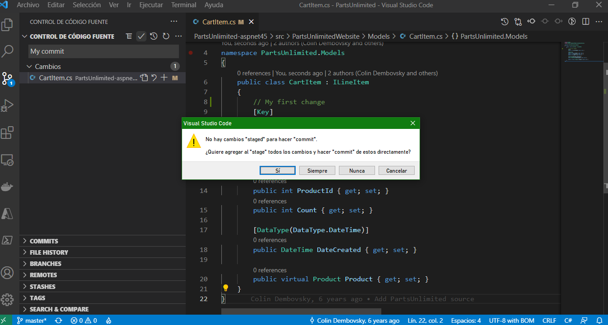

---
lab:
    title: 'Lab 02: Version Controlling with Git in Azure Repos'
    module: 'Module 2: Getting Started with Source Control'
---

# Lab 02: Version Controlling with Git in Azure Repos
# Student lab manual

## Lab overview

Azure DevOps supports two types of version control, Git and Team Foundation Version Control (TFVC). Here is a quick overview of the two version control systems:

- **Team Foundation Version Control (TFVC)**: TFVC is a centralized version control system. Typically, team members have only one version of each file on their dev machines. Historical data is maintained only on the server. Branches are path-based and created on the server.

- **Git**: Git is a distributed version control system. Git repositories can live locally (such as on a developer's machine). Each developer has a copy of the source repository on their dev machine. Developers can commit each set of changes on their dev machine and perform version control operations such as history and compare without a network connection.

Git is the default version control provider for new projects. You should use Git for version control in your projects unless you have a specific need for centralized version control features in TFVC.

In this lab, you will learn how to establish a local Git repository, which can easily be synchronized with a centralized Git repository in Azure DevOps. In addition, you will learn about Git branching and merging support. You will use Visual Studio Code, but the same processes apply for using any Git-compatible client.

## Objectives

After you complete this lab, you will be able to:

-   Clone an existing repository
-   Save work with commits
-   Review history of changes
-   Work with branches by using Visual Studio Code

## Lab duration

-   Estimated time: **50 minutes**

## Instructions

### Before you start

#### Sign in to the lab virtual machine

Ensure that you're signed in to your Windows 10 virtual machine by using the following credentials:
    
-   Username: **Student**
-   Password: **Pa55w.rd**

#### Review applications required for this lab

Identify the applications that you'll use in this lab:
    
-   Microsoft Edge
-   [Git for Windows download page](https://gitforwindows.org/). This will be installed as part of prerequisites for this lab.
-   [Visual Studio Code](https://code.visualstudio.com/). This will be installed as part of prerequisites for this lab. 

#### Set up an Azure DevOps organization

If you don't already have an Azure DevOps organization that you can use for this lab, create one by following the instructions available at [Create an organization or project collection](https://docs.microsoft.com/en-us/azure/devops/organizations/accounts/create-organization?view=azure-devops).

### Exercise 0: Configure the lab prerequisites

In this exercise, you will set up the prerequisites for the lab, which include the preconfigured Parts Unlimited team project based on an Azure DevOps Demo Generator template and a Visual Studio Code configuration.

#### Task 1: Configure the Parts Unlimited team project

In this task, you will use Azure DevOps Demo Generator to generate a new project based on the **Parts Unlimited** template.

1.  On your lab computer, start a web browser and navigate to [Azure DevOps Demo Generator](https://azuredevopsdemogenerator.azurewebsites.net). This utility site will automate the process of creating a new Azure DevOps project within your account that is prepopulated with content (work items, repos, etc.) required for the lab. 

    > **Note**: For more information on the site, see https://docs.microsoft.com/en-us/azure/devops/demo-gen.

1. Click **Sign in** and sign in using the Microsoft account associated with your Azure DevOps subscription.

1. If required, on the **Azure DevOps Demo Generator** page, click **Accept** to accept the permission requests for accessing your Azure DevOps subscription.

1. On the **Create New Project** page, in the **New Project Name** textbox, type **Version Controlling with Git in Azure Repos**, in the **Select organization** dropdown list, select your Azure DevOps organization, and then click **Choose template**.

1. In the list of templates, locate the **PartsUnlimited** template and click **Select Template**.

1.  Back on the **Create New Project** page, click **Create Project**

    > **Note**: Wait for the process to complete. This should take about 2 minutes. In case the process fails, navigate to your Azure DevOps organization, delete the project, and try again.

1. On the **Create New Project** page, click **Navigate to project**.

   

#### Task 2: Install and configure Git and Visual Studio Code

In this task, you will install and configure Git and Visual Studio Code, including configuring the Git credential helper to securely store the Git credentials used to communicate with Azure DevOps. If you have already implemented these prerequisites, you can proceed directly to the next task.

1.  If you don't have Git 2.29.2 or later installed yet, start a web browser, navigate to the [Git for Windows download page](https://gitforwindows.org/) download it, and install it. 
1.  If you don't have Visual Studio Code installed yet, from the web browser window, navigate to the [Visual Studio Code download page](https://code.visualstudio.com/), download it, and install it. 
1.  If you don't have Visual Studio C# extension installed yet, in the web browser window, navigate to the [C# extension installation page](https://marketplace.visualstudio.com/items?itemName=ms-dotnettools.csharp) and install it.
1.  On the lab computer, open **Visual Studio Code**. 
1.  In the Visual Studio Code interface, from the main menu, select **Terminal \| New Terminal** to open the **TERMINAL** pane.
1.  Make sure that the current Terminal is running **PowerShell** by checking if the drop-down list at the top right corner of the **TERMINAL** pane shows **1: powershell**

    > **Note**: To change the current Terminal shell to **PowerShell** click the drop-down list at the top right corner of the **TERMINAL** pane and click **Select Default Shell**. At the top of the Visual Studio Code window select your preferred terminal shell **Windows PowerShell** and click the plus sign on the right-hand side of the drop-down list to open a new terminal with the selected default shell.

1.  In the **TERMINAL** pane, run the following command below to configure the credential helper.

    ```git
    git config --global credential.helper wincred
    ```
1.  In the **TERMINAL** pane, run the following commands to configure a user name and email for Git commits (replace the placeholders in braces with your preferred user name and email):

    ```git
    git config --global user.name "<John Doe>"
    git config --global user.email <johndoe@example.com>
    ```



### Exercise 1: Clone an existing repository

In this exercise, you use Visual Studio Code to clone the Git repository you provisioned as part of the previous exercise.

#### Task 1: Clone an existing repository

In this task, you will step through the process of cloning a Git repository by using Visual Studio Code.

1.  Switch to the the web browser displaying your Azure DevOps organization with the **Version Controlling with Git in Azure Repos** project you generated in the previous exercise. 

    > **Note**: Alternatively, you can access the project page directly by navigating to the [https://dev.azure.com/`<your-Azure-DevOps-account-name>`/Version%20Controlling%20with%20Git%20in%20Azure%20Repos](https://dev.azure.com/`<your-Azure-DevOps-account-name>`/Version%20Controlling%20with%20Git%20in%20Azure%20Repos) URL, where the `<your-Azure-DevOps-account-name>` placeholder, represents your account name. 

1.  In the vertical navigational pane of the Azure DevOps portal, select the **Repos** icon.
1.  In the upper right corner of the **PartsUnlimited** pane, click **Clone**.

    > **Note**: Getting a local copy of a Git repo is called *cloning*. Every mainstream development tool supports this and will be able to connect to Azure Repos to pull down the latest source to work with.

2.  On the **Clone Repository** panel, with the **HTTPS** Command line option selected, click the **Copy to clipboard** button next to the repo clone URL. 

    > **Note**: You can use this URL with any Git-compatible tool to get a copy of the codebase.

3.  Close the **Clone Repository** panel.
4.  Switch to **Visual Studio Code** running on your lab computer. 
5.  Click the **View** menu header and, in the drop-down menu, click **Command Palette**. 

    > **Note**: The Command Palette provides an easy and convenient way to access a wide variety of tasks, including those implemented as 3rd party extensions. You can use the keyboard shortcut **Ctrl+Shift+P** or **F1** to open it.

6.  At the Command Palette prompt, run the **Git: Clone** command. 

    > **Note**: To see all relevant commands, you can start by typing **Git**.

7.  In the **Provide repository URL or pick a repository source** text box, paste the repo clone URL you copied earlier in this task and press the **Enter** key.
8.  Within the **Select Folder** dialog box, navigate to the C: drive, create a new folder named **Git**, select it, and then click **Select Repository Location**. 
9.  When prompted, log in to your Azure DevOps account.
10. After the cloning process completes, once prompted, in the Visual Studio Code, click **Open** to open the cloned repository. 

    > **Note**: You can ignore warnings you might receive regarding problems with loading of the project. The solution may not be in the state suitable for a build, but we're going to focus on working with Git, so building the project is not required.



### Exercise 2: Save work with commits

In this exercise, you will step through several scenarios that involve the use of Visual Studio Code to stage and commit changes.

When you make changes to your files, Git will record the changes in the local repository. You can select the changes that you want to commit by staging them. Commits are always made against your local Git repository, so you don't have to worry about the commit being perfect or ready to share with others. You can make more commits as you continue to work and push the changes to others when they are ready to be shared.

Git commits consists of the following:

- The file(s) changed in the commit. Git keeps the contents of all file changes in your repo in the commits. This keeps it fast and allows intelligent merging.
- A reference to the parent commit(s). Git manages your code history using these references.
- A message describing a commit. You give this message to Git when you create the commit. It's a good idea to keep this message descriptive, but to the point.

#### Task 1: Commit changes

In this task, you will use Visual Studio Code to commit changes.

1. In the Visual Studio Code window, at the top of the vertical toolbar, select the **EXPLORER** tab, navigate to the **/PartsUnlimited-aspnet45/src/PartsUnlimitedWebsite/Models/CartItem.cs** file and select it. This will automatically display its content in the details pane.

1.  Add to the **CartItem.cs** file right above the `[key]` entry an extra line containing the following comment: 

    ```csharp
    // My first change
    ```

    > **Note**: It doesn't really matter what the comment is since the goal is just to make a change. 

1. Press **Ctrl+S** to save the change.

1. In the Visual Studio Code window, select the **SOURCE CONTROL** tab to verify that Git recognized the latest change to the file residing in the local clone of the Git repository.

1. With the **SOURCE CONTROL** tab selected, at the top of the pane, in the textbox, type **My commit** as the commit message and press **Ctrl+Enter** to commit it locally.

1.  If prompted whether you would like to automatically stage your changes and commit them directly, click **Always**. 

    > **Note**: We will discuss **staging** later in the lab.

1. In the lower left corner of the Visual Studio Code window, to the right of the **master** label, note the **Synchronize Changes** icon of a circle with two vertical arrows pointing in the opposite directions and the number **1** next to the arrow pointing up. Click the icon and, if prompted, whether to proceed, click **OK** to push and pull commits to and from **origin/master**. 

   

#### Task 2: Review commits

In this task, you will use the Azure DevOps portal to review commits.

1.  Switch to the web browser window displaying the Azure DevOps interface. 
1.  In the vertical navigational pane of the of the Azure DevOps portal, in the **Repos** section, select **Commits**.
1.  Verify that your commit appears at the top of list.

#### Task 3: Stage changes

In this task, you will explore the use of staging changes by using Visual Studio Code. Staging changes allows you to selectively add certain files to a commit while passing over the changes made in other files.

1.  Switch back to the **Visual Studio Code** window.
1.  Update the open **CartItem.cs** class by changing the first comment to `//My second change` and saving the file.
1.  In the Visual Studio Code window, switch back the **EXPLORER** tab, navigate to the **/PartsUnlimited-aspnet45/src/PartsUnlimitedWebsite/Models/Category.cs** file and select it. This will automatically display its content in the details pane.
1.  Add to the **Category.cs** file right above the `public int CategoryId { get; set; }` entry an extra line containing the following comment and save the file.

    ```csharp
    // My third change
    ```

1.  In the Visual Studio Code window, switch to the **SOURCE CONTROL** tab, hover the mouse pointer over the **CartItem.cs** entry, and click the plus sign on the right side of that entry. 

    > **Note**: This stages the change to the **CartItem.cs** file only, preparing it for commit without **Category.cs**.

1.  With the **SOURCE CONTROL** tab selected, at the top of the pane, in the textbox, type **Added comments** as the commit message.
1.  At the top of the **SOURCE CONTROL** tab, click the ellipsis symbol, in the drop-down menu, select **Commit** and, in the cascading menu, select **Commit Staged**. 
1.  In the lower left corner of the Visual Studio Code window, click the **Synchronize Changes** button to synchronize the committed changes with the server and, if prompted, whether to proceed, click **OK** to push and pull commits to and from **origin/master**. 

    > **Note**: Note that since only the staged change was committed, the other change is still pending to be synchronized.

### Exercise 3: Review history

In this exercise, you will use the Azure DevOps portal to review history of commits.

Git uses the parent reference information stored in each commit to manage a full history of your development. You can easily review this commit history to find out when file changes were made and determine differences between versions of your code using the terminal or from one of the many available Visual Studio Code extensions. You can also review changes by using the Azure DevOps portal.

Git's use of the **Branches and Merges** feature works through pull requests, so the commit history of your development doesn't necessarily form a straight, chronological line. When you use history to compare versions, think in terms of file changes between two commits instead of file changes between two points in time. A recent change to a file in the master branch may have come from a commit created two weeks ago in a feature branch that was merged yesterday.

#### Task 1: Compare files

In this task, you will step through commit history by using the Azure DevOps portal.

1.  With the **SOURCE CONTROL** tab of the Visual Studio Code window open, select **Category.cs** representing the non-staged version of the file.

    > **Note**: A comparison view is opened to enable you to easily locate the changes you've made. In this case, it's just the one comment.

1.  Switch to the web browser window displaying the **Commits** pane of the **Azure DevOps** portal to review the source branches and merges. These provide a convenient way to visualize when and how changes were made to the source.
1.  Scroll down to the **Merged PR 27** entry and hover the mouse pointer over it to reveal the ellipsis symbol on the right side.
1.  Click the ellipsis, in the dropdown menu, select **Browse Files**, and review the results.

    > **Note**: This view represents the state of the source corresponding to the commit, allowing you to review and download each of source files.

### Exercise 4: Work with branches

In this exercise, you will step through scenarios that involve branch management by using Visual Studio Code and the Azure DevOps portal.

You can manage the in your Azure DevOps Git repo from the **Branches** view of **Azure Repos** in the Azure DevOps portal. You can also customize the view to track the branches you care most about so you can stay on top of changes made by your team.

Committing changes to a branch will not affect other branches and you can share branches with others without having to merge the changes into the main project. You can also create new branches to isolate changes for a feature or a bug fix from your master branch and other work. Since the branches are lightweight, switching between branches is quick and easy. Git does not create multiple copies of your source when working with branches, but rather uses the history information stored in commits to recreate the files on a branch when you start working on it. Your Git workflow should create and use branches for managing features and bugfixes. The rest of the Git workflow, such as sharing code and reviewing code with pull requests, all work through branches. Isolating work in branches makes it very simple to change what you are working on by simply changing your current branch.

#### Task 1: Create a new branch in your local repository

In this task, you will create a branch by using Visual Studio Code.

1.  Switch to **Visual Studio Code** running on your lab computer. 
1.  With the **SOURCE CONTROL** tab selected, in the lower left corner of the Visual Studio Code window, click **master**.
1.  In the pop-up window, select **+ Create new branch from...**.
1.  In the **Branch name** textbox, type **dev** to specify the new branch and press **Enter**.
1.  In the **Select a ref to create the 'dev' branch from** textbox, select **master** as the reference branch.

    > **Note**: At this point, you are automatically switched to the **dev** branch.

#### Task 2: Work with branches

In this task, you will use the Visual Studio Code to work with a branch created in the previous task.

Git keeps track of which branch you are working on and makes sure that, when you check out a branch, your files match the most recent commit on that branch. Branches let you work with multiple versions of the source code in the same local Git repository at the same time. You can use Visual Studio Code to publish, check out and delete branches.

1.  In the **Visual Studio Code** window, with the **SOURCE CONTROL** tab selected, in the lower left corner of the Visual Studio Code window, click the **Publish changes** icon (directly to the right of the **dev** label representing your newly created branch).
1.  Switch to the web browser window displaying the **Commits** pane of the **Azure DevOps** portal and select **Branches**.
1.  On the **Mine** tab of the **Branches** pane, verify that the list of branches includes **dev**.
1.  Hover the mouse pointer over the **dev** branch entry to reveal the ellipsis symbol on the right side.
1.  Click the ellipsis, in the pop-up menu, select **Delete branch**, and, when prompted for confirmation, click **Delete**.
1.  Switch back to the **Visual Studio Code** window and, with the **SOURCE CONTROL** tab selected, in the lower left corner of the Visual Studio Code window, click the **dev** entry. This will display the existing branches in the upper portion of the Visual Studio Code window.
1.  Verify that now there are two **dev** branches listed. 

    > **Note**: The local (**dev**) branch is listed because it's existence is not affected by the deletion of the branch in the remote repository. The server (**origin/dev**) is listed because it hasn't been pruned. 

1.  In the list of branches select the **master** branch to check it out.
1.  Press **Ctrl+Shift+P** to open the **Command Palette**.
1.  At the **Command Palette** prompt, start typing **Git: Delete** and select **Git: Delete Branch** when it becomes visible.
1.  Select the **dev** entry in the list of branches to delete.
1.  In the lower left corner of the Visual Studio Code window, click the **master** entry again. This will display the existing branches in the upper portion of the Visual Studio Code window.
1.  Verify that the local **dev** branch no longer appears in the list, but the remote **origin/dev** is still there.
1.  Press **Ctrl+Shift+P** to open the **Command Palette**.
1.  At the **Command Palette** prompt, start typing **Git: Fetch** and select **Git: Fetch (Prune)** when it becomes visible. 

    > **Note**: This command will update the origin branches in the local snapshot and delete those that are no longer there.

    > **Note**: You can check in on exactly what these tasks are doing by selecting the **Output** window in the lower right part bottom of the Visual Studio Code window. If you don't see the Git logs in the output console, make sure to select **Git** as the source.

1.  In the lower left corner of the Visual Studio Code window, click the **master** entry again.
1.  Verify that the **origin/dev** branch no longer appears in the list of branches.

#### Review

In this lab, you used Visual Studio Code to clone an existing repository, save work with commits, review history of changes, and work with branches.
