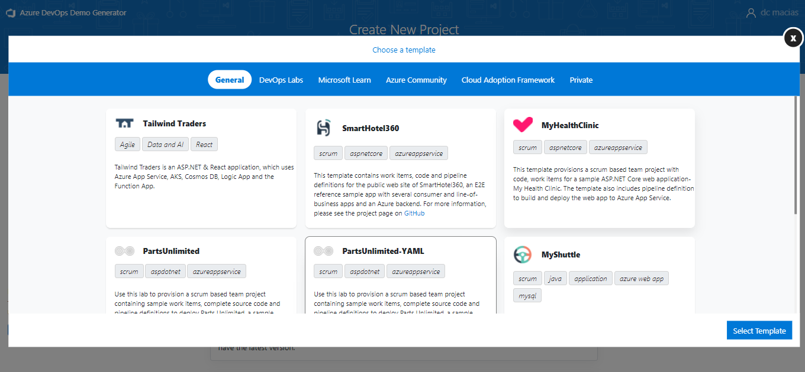
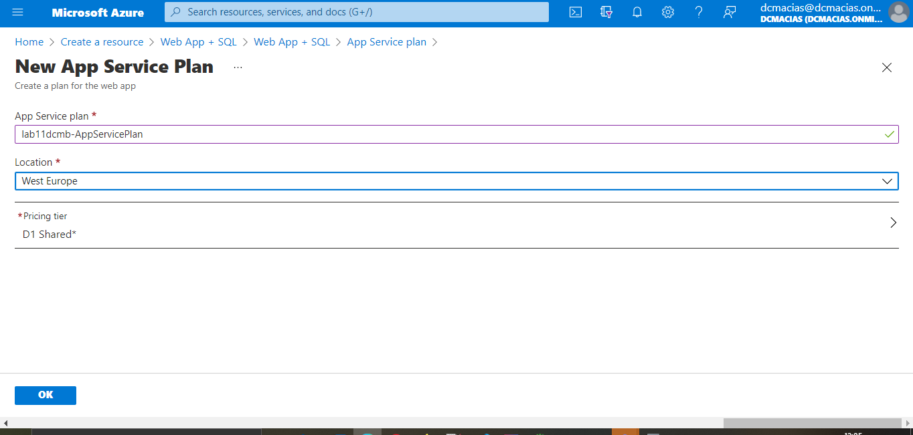
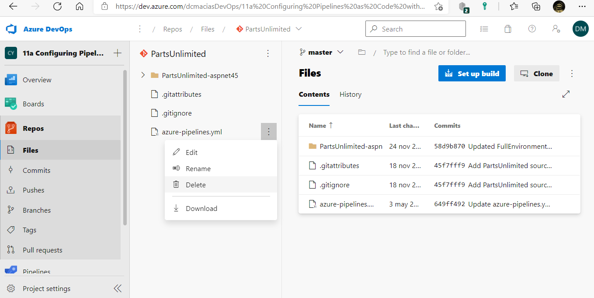
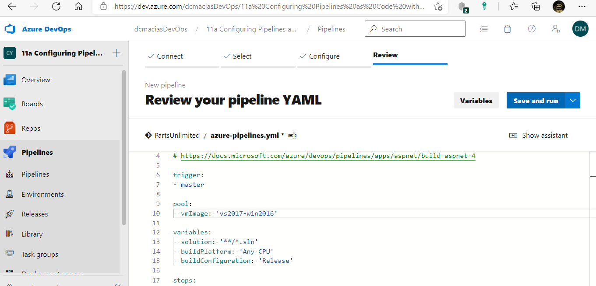

---
lab:
    title: 'Lab 11a: Configuring Pipelines as Code with YAML'
    module: 'Module 11: Implementing Continuous Deployment using Azure Pipelines'
---

# Lab 11a: Configuring Pipelines as Code with YAML
# Student lab manual

## Lab overview

Many teams prefer to define their build and release pipelines using YAML. This allows them to access the same pipeline features as those using the visual designer, but with a markup file that can be managed like any other source file. YAML build definitions can be added to a project by simply adding the corresponding files to the root of the repository. Azure DevOps also provides default templates for popular project types, as well as a YAML designer to simplify the process of defining build and release tasks.

## Objectives

After you complete this lab, you will be able to:

- configure CI/CD pipelines as code with YAML in Azure DevOps

## Lab duration

-   Estimated time: **60 minutes**

## Instructions

### Before you start

#### Sign in to the lab virtual machine

Ensure that you're signed in to your Windows 10 virtual machine by using the following credentials:
    
-   Username: **Student**
-   Password: **Pa55w.rd**

#### Review applications required for this lab

Identify the applications that you'll use in this lab:
    
-   Microsoft Edge

#### Set up an Azure DevOps organization. 

If you don't already have an Azure DevOps organization that you can use for this lab, create one by following the instructions available at [Create an organization or project collection](https://docs.microsoft.com/en-us/azure/devops/organizations/accounts/create-organization?view=azure-devops).

#### Prepare an Azure subscription

-   Identify an existing Azure subscription or create a new one.
-   Verify that you have a Microsoft account or an Azure AD account with the Owner role in the Azure subscription and the Global Administrator role in the Azure AD tenant associated with the Azure subscription. For details, refer to [List Azure role assignments using the Azure portal](https://docs.microsoft.com/en-us/azure/role-based-access-control/role-assignments-list-portal) and [View and assign administrator roles in Azure Active Directory](https://docs.microsoft.com/en-us/azure/active-directory/roles/manage-roles-portal#view-my-roles).

### Exercise 0: Configure the lab prerequisites

In this exercise, you will set up the prerequisites for the lab, which consist of the preconfigured Parts Unlimited team project based on an Azure DevOps Demo Generator template and Azure resources, including an Azure web app and an Azure SQL database. 

#### Task 1: Configure the team project

In this task, you will use Azure DevOps Demo Generator to generate a new project based on the **PartsUnlimited-YAML** template.

1.  On your lab computer, start a web browser and navigate to [Azure DevOps Demo Generator](https://azuredevopsdemogenerator.azurewebsites.net). This utility site will automate the process of creating a new Azure DevOps project within your account that is prepopulated with content (work items, repos, etc.) required for the lab. 

    > **Note**: For more information on the site, see https://docs.microsoft.com/en-us/azure/devops/demo-gen.

1. Click **Sign in** and sign in using the Microsoft account associated with your Azure DevOps subscription.

1. If required, on the **Azure DevOps Demo Generator** page, click **Accept** to accept the permission requests for accessing your Azure DevOps subscription.

   

1. On the **Create New Project** page, in the **New Project Name** textbox, type **Configuring Pipelines as Code with YAML**, in the **Select organization** dropdown list, select your Azure DevOps organization, and then click **Choose template**.

1. In the list of templates, in the toolbar, click **General**, select the **PartsUnlimited-YAML** template and click **Select Template**.

1.  Back on the **Create New Project** page, click **Create Project**

    > **Note**: Wait for the process to complete. This should take about 2 minutes. In case the process fails, navigate to your DevOps organization, delete the project, and try again.

1.  On the **Create New Project** page, click **Navigate to project**.

#### Task 2: Create Azure resources

In this task, you will create an Azure web app and an Azure SQL database by using the Azure portal.

1. From the lab computer, start a web browser, navigate to the [**Azure Portal**](https://portal.azure.com), and sign in with the user account that has the Owner role in the Azure subscription you will be using in this lab and has the role of the Global Administrator in the Azure AD tenant associated with this subscription.

1. In the Azure portal, click the icon consisting of three horizontal lines in the upper left corner of the page and, in the hub menu and click **+ Create a resource**.

1. On the **New** blade, in the search text box, type **Web App + SQL** and press the **Enter** key.

1. On the **Web App + SQL**, click **Create**.

1. 

1.  On the **Web App + SQL** blade, specify the following settings:

    | Setting | Value |
    | --- | --- |
    | App name | any valid, globally unique DNS host name |
    | Subscription | the name of the Azure subscription you are using in this lab |
    | Resource group | the name of a new resource group **az400m11l01-RG** |

1. Click **App Service plan/Location**, on the **App Service plan** blade, click **+ Create new**.

1. 

1.  On the **New App Service Plan** blade, specify the following settings and click **OK**:

    | Setting | Value |
    | --- | --- |
    | App service plan | any valid name |
    | Location| the name of the Azure region where you want to deploy resources you will be using in this lab |
    | Pricing tier | **D1 Shared** |

1. Back on the **Web App + SQL** blade, click **SQL Database**.

1. On the **SQL Database** blade, in the **Name** textbox, type **partsunlimited**.

1. 

1. On the **SQL Database** blade, click **Target server**.

1.  On the **New server** blade, specify the following settings and click **Select**:

    | Setting | Value |
    | --- | --- |
    | Server name | any valid, globally unique DNS host name |
    | Server admin login | Student |
    | Password | Pa55w.rd1234 |
    | Location | the name of the Azure region that you chose for the App Service plan |
    | Allow Azure services to access server | enabled |

1. Back on the **SQL Database** blade, click **Select**.

1.  Back on the **Web App + SQL** blade, click **Create**. 

    > **Note**: Wait for the process to complete. This should take about 2 minutes. 

### Exercise 1: Configure CI/CD Pipelines as Code with YAML in Azure DevOps

In this exercise, you will configure CI/CD Pipelines as code with YAML in Azure DevOps.

#### Task 1: Delete the existing pipeline

In this task, you will delete the existing pipeline.

1.  On the lab computer, switch to the browser window displaying the **Configuring Pipelines as Code with YAML** project in the Azure DevOps portal and, in the vertical navigational pane, select the **Pipelines**.

    > **Note**: Before configuring YAML pipelines, you will disable the existing build pipeline.

1. On the **Pipelines** pane, select the **PartsUnlimited** entry. 

1. In the upper right corner of the **PartsUnlimited** blade, click the vertical ellipsis symbol and, in the drop-down menu, select **Delete**.

1. Write **PartsUnlimited** and click **Delete**.

   

1. In the vertical navigational pane, select the **Repos > Files**. Make sure you are in the **master** branch (dropdown on top of **Files** window), on the **azure-pipelines.yml** file, click the vertical ellipsis symbol and, in the drop-down menu, select **Delete**. Commit the change on the master branch by clicking on **Commit** (leaving default options).

1.  

#### Task 2: Add a YAML build definition

In this task, you will add a YAML build definition to the existing project.

1. Navigate back to the **Pipelines** pane in of the **Pipelines** hub. 

1.  In the **Create your first Pipeline** window, click **Create pipeline**. 

    > **Note**: We will use the wizard to automatically create the YAML definition based on our project.

3. On the **Where is your code?** pane, click **Azure Repos Git (YAML)** option.

4. On the **Select a repository** pane, click **PartsUnlimited**.

5. On the **Configure your pipeline** pane, click **ASP<nolink>.NET** to use this template as the starting point for your pipeline. This will open the **Review your pipeline YAML** pane.

   > **Note**: The pipeline definition will be saved as a file named **azure-pipelines.yml** in the root of the repository. The file will contain the steps required to build and test a typical ASP<nolink>.NET solution. You can also customize the build as needed. In this scenario, you will update the **pool** to enforce the use of a VM running Visual Studio 2017.

   

6. Make sure  `trigger` is **master**.

   > **Note**: Review in Repos if your repository has **master** or **main** branch, organizations could choose default branch name for new repos: [Change the default branch](https://docs.microsoft.com/en-us/azure/devops/repos/git/change-default-branch?view=azure-devops#choosing-a-name). 

7. On the **Review your pipeline YAML** pane, in line **10**, replace `vmImage: 'windows-latest'` with `vmImage: 'vs2017-win2016'`.

8. On the **Review your pipeline YAML** pane, click **Save and run**.

9. 

10. On the **Save and run** pane, accept the default settings and click **Save and run**.

11. On the pipeline run pane, in the **Jobs** section, click **Job** and monitor its progress and verify that it completes successfully. 

    > **Note**: Each task from the YAML file is available for review, including any warnings and errors.

12. Return to the pipeline run pane, switch from the **Summary** tab to the **Tests** tab, and review test statistics.

#### Task 3: Add continuous delivery to the YAML definition

In this task, you will add continuous delivery to the YAML-based definition of the pipeline you created in the previous task.

> **Note**: Now that the build and test processes are successful, we can now add delivery to the YAML definition. 

1.  On the pipeline run pane, click the ellipsis symbol in the upper right corner and, in the dropdown menu, click **Edit pipeline**.
1.  On the pane displaying the content of the **azure-pipelines.yaml** file, in line **8**, following the `trigger` section, add the following content to define the **Build** stage in the YAML pipeline. 

    > **Note**: You can define whatever stages you need to better organize and track pipeline progress.

    ```yaml
    stages:
    - stage: Build
      jobs:
      - job: Build
    ```

1.  Select the remaining content of the YAML file and press the **Tab** key twice to indent it four spaces (it should be placed with same identation as ```job: Build```). 

    > **Note**: This way, everything starting with the `pool` section becomes part of the `job: Build`. 

1.  At the bottom of the file, add the configuration below to define the second stage.

    ```yaml
    - stage: Deploy
      jobs:
      - job: Deploy
        pool:
          vmImage: 'vs2017-win2016'
        steps:
    ```

1.  Set the cursor on a new line at the end of the YAML definition. 

    > **Note**: This will be the location where new tasks are added.

1.  In the list of tasks on the right side of the code pane, search for and select the **Azure App Service Deploy** task.
1.  In the **Azure App Service deploy** pane, specify the following settings and click **Add**:

    - in the **Azure subscription** drop-down list, select the Azure subscription into which you deployed the Azure resources earlier in the lab, click **Authorize**, and, when prompted, authenticate by using the same user account you used during the Azure resource deployment.
    - in the **App Service name** dropdown list, select the name of the web app you deployed earlier in the lab. 
    - in the **Package or folder** text box, type `$(System.ArtifactsDirectory)/drop/*.zip`. 

    > **Note**: This will automatically add the deployment task to the YAML pipeline definition.

1.  With the added task still selected in the editor, press the **Tab** key twice to indent it four spaces, so that it listed as a child of the **steps** task.

    > **Note**: The **packageForLinux** parameter is misleading in the context of this lab, but it is valid for Windows or Linux. 

    > **Note**: By default, these two stages run independently. As a result, the build output from the first stage might not be available to the second stage without additional changes. To implement these changes, we will use one task to publish the build output at the end of the build stage and another to download it in the beginning of the deploy stage. 

1.  Place the cursor on a blank line at the end of the build stage to add another task. (right below  `task: VSTest@2` )
1.  On the **Tasks** pane, search for and select the **Publish build artifacts** task. 
1.  On the **Publish build artifacts** pane, accept the default settings and click **Add**. 

    > **Note**: This will publish the build artifacts to a location that will be downloadable under the alias **drop**.

1.  With the added task still selected in the editor, press the **Tab** key twice to indent it four spaces (or press the **Tab** until task is indented as the ones above).

    > **Note**: You may also want to add an empty line before and after to make it easier to read.

1.  Place the cursor on the first line under the **steps** node of the **deploy** stage.
1.  On the **Tasks** pane, search for and select the **Download build artifacts** task.
1.  Click **Add**.
1.  With the added task still selected in the editor, press the **Tab** key twice to indent it four spaces. 

    > **Note**: Here as well you may also want to add an empty line before and after to make it easier to read.

1.  Add a property to the download task specifying the `artifactName` of `drop` (make sure to match the spacing):

    ```
    artifactName: 'drop'
    ```

1.  Click **Save**, on the **Save** pane, click **Save** again to commit the change directly into the master branch.

    > **Note**: This will automatically trigger a new build.

1.  The pipeline will look similar to this example  (**Reference your own subscription and webapp on last task**):

    ```
    trigger:
    - master

    stages:
    - stage: Build
      jobs:
      - job: Build
        pool:
            vmImage: 'vs2017-win2016'

        variables:
            solution: '**/*.sln'
            buildPlatform: 'Any CPU'
            buildConfiguration: 'Release'

        steps:
        - task: NuGetToolInstaller@1

        - task: NuGetCommand@2
          inputs:
            restoreSolution: '$(solution)'

        - task: VSBuild@1
          inputs:
            solution: '$(solution)'
            msbuildArgs: '/p:DeployOnBuild=true /p:WebPublishMethod=Package /p:PackageAsSingleFile=true /p:SkipInvalidConfigurations=true /p:PackageLocation="$(build.artifactStagingDirectory)"'
            platform: '$(buildPlatform)'
            configuration: '$(buildConfiguration)'

        - task: VSTest@2
          inputs:
            platform: '$(buildPlatform)'
            configuration: '$(buildConfiguration)'

        - task: PublishBuildArtifacts@1
          inputs:
            PathtoPublish: '$(Build.ArtifactStagingDirectory)'
            ArtifactName: 'drop'
            publishLocation: 'Container'

    - stage: Deploy
      jobs:
      - job: Deploy
        pool:
            vmImage: 'vs2017-win2016'
        steps:
        - task: DownloadBuildArtifacts@0
          inputs:
            buildType: 'current'
            downloadType: 'single'
            downloadPath: '$(System.ArtifactsDirectory)'
            artifactName: 'drop'
        - task: AzureRmWebAppDeployment@4
          inputs:
            ConnectionType: 'AzureRM'
            azureSubscription: 'YOUR-AZURE-SUBSCRIPTION'
            appType: 'webApp'
            WebAppName: 'YOUR-WEBAPP-NAME'
            packageForLinux: '$(System.ArtifactsDirectory)/drop/*.zip'
    ```

1.  In the web browser window displaying the Azure DevOps portal, in the vertical navigational pane, select the **Pipelines**.
1.  On the **Pipelines** pane, click the entry representing the newly configured pipeline.
1. Click on the most recent run (automatically started).
1.  On the **Summary** pane, monitor the progress of the pipeline run.
1.  If you notice a message stating that *This pipeline needs permissions to access a resource before this run can continue to Deploy*, click **View**, in the **Waiting for review** dialog box, click **Permit**, and, in the **Permit access?** pane, click **Permit** again.
1.  At the bottom of the **Summary** pane, click the **Deploy** stage to view details of the deployment.

    > **Note**: Once the task completes, your app will be deployed to an Azure web app.

#### Task 4: Review the deployed site

1.  Switch back to web browser window displaying the Azure portal and navigate to the blade displaying the properties of the Azure web app.
1.  On the Azure web app blade, in the **Settings** section, select **Configuration**.
1.  On the Azure web app configuration blade, in the **Connection strings** section, click the **defaultConnection** entry.
1.  On the **Add/Edit connection string** blade, in the **Name** textbox, change the current value to **DefaultConnectionString**, which is the key expected by the application, and click **OK**.

    > **Note**: This will enable the application to connect to the database created for the app service. 

1.  Back on the Azure web app configuration blade, click **Save** to apply the changes and, when prompted, click **Continue**
1.  On the Azure web app blade, click **Overview** and, on the overview blade, click **Browse** to open your site in a new web browser tab.
1.  Verify that the deployed site loads as expected in the new browser tab.

### Exercise 2: Remove the Azure lab resources

In this exercise, you will remove the Azure resources provisione in this lab to eliminate unexpected charges. 

>**Note**: Remember to remove any newly created Azure resources that you no longer use. Removing unused resources ensures you will not see unexpected charges.

#### Task 1: Remove the Azure lab resources

In this task, you will use Azure Cloud Shell to remove the Azure resources provisioned in this lab to eliminate unnecessary charges. 

1.  In the Azure portal, open the **Bash** shell session within the **Cloud Shell** pane.
1.  List all resource groups created throughout the labs of this module by running the following command:

    ```sh
    az group list --query "[?starts_with(name,'az400m11l01-RG')].name" --output tsv
    ```

1.  Delete all resource groups you created throughout the labs of this module by running the following command:

    ```sh
    az group list --query "[?starts_with(name,'az400m11l01-RG')].[name]" --output tsv | xargs -L1 bash -c 'az group delete --name $0 --no-wait --yes'
    ```

    >**Note**: The command executes asynchronously (as determined by the --nowait parameter), so while you will be able to run another Azure CLI command immediately afterwards within the same Bash session, it will take a few minutes before the resource groups are actually removed.

## Review

In this lab, you configured CI/CD pipelines as code with YAML in Azure DevOps.
