---
lab:
    title: 'Lab 14b: Automating infrastructure deployments in the Cloud with Terraform and Azure Pipelines'
    module: 'Module 14: Third party Infrastructure as Code Tools Available with Azure'
---

# Lab 14b: Automating infrastructure deployments in the Cloud with Terraform and Azure Pipelines
# Student lab manual

## Lab overview

[Terraform](https://www.terraform.io/intro/index.html) is a tool for building, changing and versioning infrastructure. Terraform can manage existing and popular cloud service providers as well as custom in-house solutions.

Terraform configuration files describe the components needed to run a single application or your entire datacenter. Terraform generates an execution plan describing what it will do to reach the desired state, and then executes it to build the described infrastructure. As the configuration changes, Terraform is able to determine what changed and create incremental execution plans to execute. 

In this lab, you will learn how to incorporate Terraform into Azure Pipelines for implementing Infrastructure as Code. 

## Objectives

After you complete this lab, you will be able to:

- Use Terraform to implement Infrastructure as Code
- Automate infrastructure deployments in Azure with Terraform and Azure Pipelines

## Lab duration

-   Estimated time: **60 minutes**

## Instructions

### Before you start

#### Sign in to the lab virtual machine

Ensure that you're signed in to your Windows 10 virtual machine by using the following credentials:
    
-   Username: **Student**
-   Password: **Pa55w.rd**

#### Review applications required for this lab

Identify the applications that you'll use in this lab:
    
-   Microsoft Edge

#### Set up an Azure DevOps organization. 

If you don't already have an Azure DevOps organization that you can use for this lab, create one by following the instructions available at [Create an organization or project collection](https://docs.microsoft.com/en-us/azure/devops/organizations/accounts/create-organization?view=azure-devops).

#### Prepare an Azure subscription

-   Identify an existing Azure subscription or create a new one.
-   Verify that you have a Microsoft account or an Azure AD account with the Owner role in the Azure subscription and the Global Administrator role in the Azure AD tenant associated with the Azure subscription.

### Exercise 0: Configure the lab prerequisites

In this exercise, you will set up the prerequisites for the lab, which consist of the preconfigured Parts Unlimited team project based on an Azure DevOps Demo Generator template. 

#### Task 1: Configure the team project

In this task, you will use Azure DevOps Demo Generator to generate a new project based on the **Terraform** template.

1.  On your lab computer, start a web browser and navigate to [Azure DevOps Demo Generator](https://azuredevopsdemogenerator.azurewebsites.net). This utility site will automate the process of creating a new Azure DevOps project within your account that is prepopulated with content (work items, repos, etc.) required for the lab. 

    > **Note**: For more information on the site, see https://docs.microsoft.com/en-us/azure/devops/demo-gen.

1. Click **Sign in** and sign in using the Microsoft account associated with your Azure DevOps subscription.

1. If required, on the **Azure DevOps Demo Generator** page, click **Accept** to accept the permission requests for accessing your Azure DevOps subscription.

1. On the **Create New Project** page, in the **New Project Name** textbox, type **Automating infrastructure deployments with Terraform**, in the **Select organization** dropdown list, select your Azure DevOps organization, and then click **Choose template**.

1. In the list of templates, in the toolbar, click **DevOps Labs**, select the **Terraform** template and click **Select Template**.

1.  Back on the **Create New Project** page, if prompted to install a missing extension, select the checkbox below the **Replace Tokens** and **Terraform** labels and click **Create Project**.

    > **Note**: Wait for the process to complete. This should take about 2 minutes. In case the process fails, navigate to your DevOps organization, delete the project, and try again.

1. On the **Create New Project** page, click **Navigate to project**.

   

### Exercise 1: Automate infrastructure deployments in the cloud with Terraform and Azure Pipelines

In this exercise, you will deploy Infrastructure as Code into Azure by using Terraform and Azure Pipelines

#### Task 1: Examine the Terraform configuration files

In this task, you will examine the use of Terraform in provisioning Azure Resources required to deploy PartsUnlimited website.

1.  On your lab computer, in the web browser window displaying the Azure DevOps portal with the **Automating infrastructure deployments with Terraform** project open, in the vertical menu bar at the far left of the Azure DevOps portal, click **Repos**.
1.  On the **Files** pane, click the facing-down caret next to the **master** entry at the top and, in the dropdown list of branches, click the entry representing the **terraform** branch.

    > **Note**: Make sure that you are now on the **terraform** branch and **Terraform** folder appears within the content of the repo. 

1.  In the folder hierarchy of the **Terraform** repo, expand the **Terraform** folder and click **webapp.tf**.
1.  Review the content of the **webapp.tf** file. 

    > **Note**: **webapp.tf** is a terraform configuration file. Terraform uses its own file format, called HCL (Hashicorp Configuration Language), similar to YAML.

    > **Note**: In this example, we want to create an Azure Resource group, App service plan and App service required to deploy a website. We have added the Terraform file to source control repository in the Azure DevOps project so you can use it to deploy the required Azure resources. 


#### Task 2: Build your application using Azure CI Pipeline

In this task, you will build your application and publish the required files as an artifact called drop.

1. In the Azure DevOps portal, in the vertical menu bar at the left of the Azure DevOps portal, click **Pipelines**. Underneath, select **Pipelines**.

1. On the **Pipelines** pane, click **Terraform-CI** to select it and, on the **Terraform-CI** pane, click **Edit**.

   > **Note**: This CI pipeline has tasks to compile the .NET Core project. The DotNet tasks in the pipeline will restore dependencies, build, test and publish the build output into a zip file (package), which can be deployed to a web application. In addition to the application build, we need to publish terraform files to build artifacts to make them available in CD pipeline. This is the reason for the **Copy files** task to copy Terraform file to Artifacts directory.

   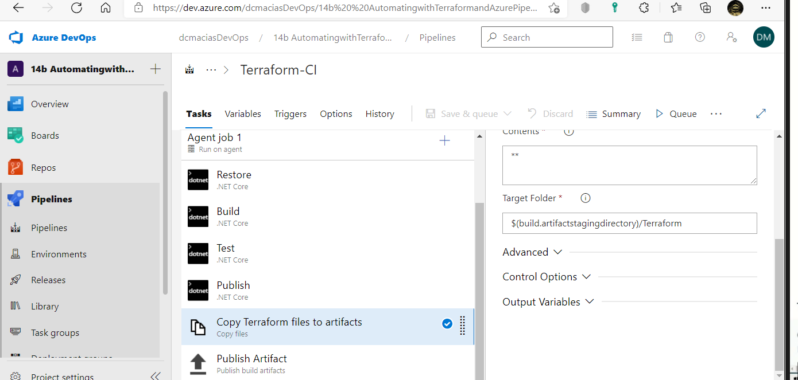

1. Once you review the **Tasks** tab of the **Terraform-CI** pane, click the ellipsis symbol in the top right corner and, in the dropdown menu, click **Queue**.

   

1. On the **Run pipeline** pane, click **Run** to initiate the build. 

   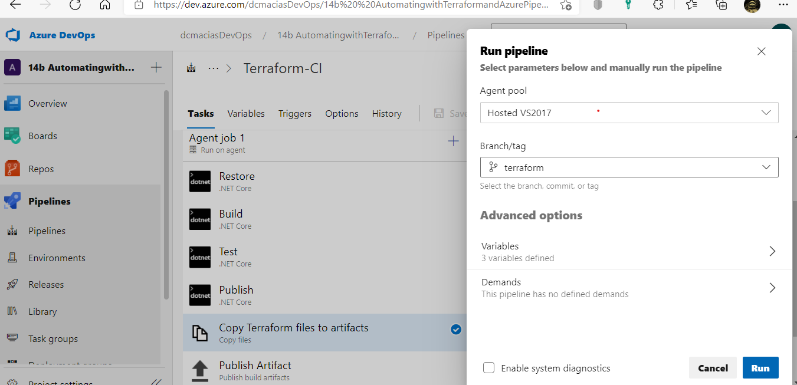

1. On the **Summary** tab of the build run pane, in the **Jobs** section, click **Agent job 1** and monitor the progress of the build process.

   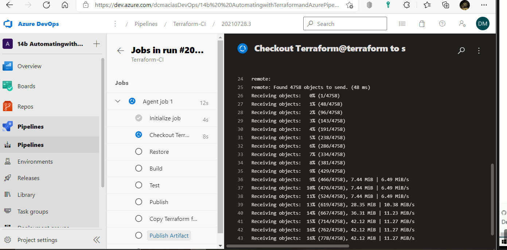

1. Once the build succeeds, switch back to the **Summary** tab of the build run pane, in the **Related** section, click the **1 published, 1 consumed** link. This will display the **Artifacts** pane.

   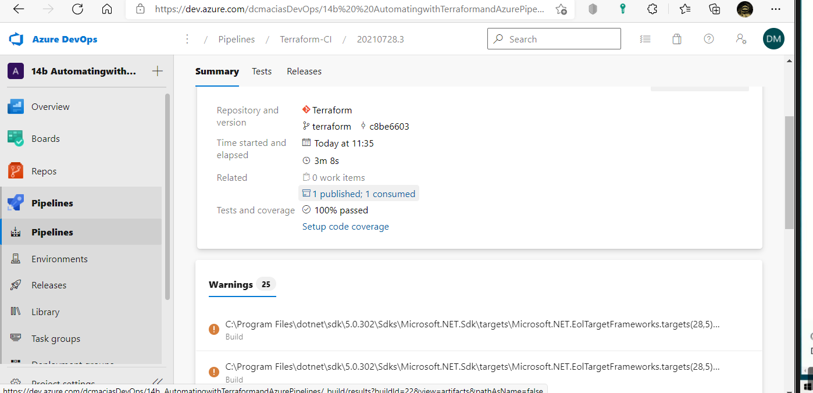

1.  On the **Artifacts** pane, on the **Published** tab, expand the **drop** folder, verify that it contains the **PartsUnlimitedwebsite.zip** file, then expand its **Terraform** subfolder, and verify that it includes the **webapp.tf** file. 

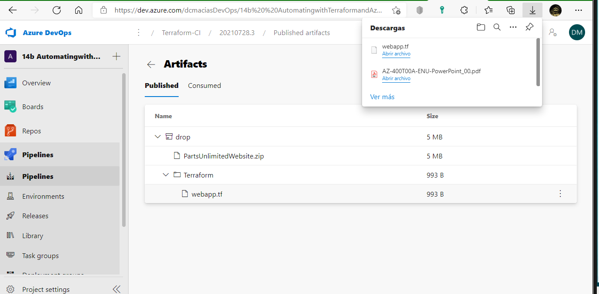

#### Task 3: Deploy resources using Terraform (IaC) in Azure CD pipeline

In this task, you will create Azure resources using Terraform as part of your deployment pipeline and then deploy the PartsUnlimited application to an Azure app service web app provisioned by Terraform.

1. In the Azure DevOps portal, in the vertical menu bar at the left of the Azure DevOps portal, in the **Pipelines** section, click **Releases**, ensure that the **Terraform-CD** entry is selected, and click **Edit**.

1. On the **All pipelines > Terraform-CD** pane, in the rectangle representing the **Dev** stage, click the **1 job, 8 tasks** link.

   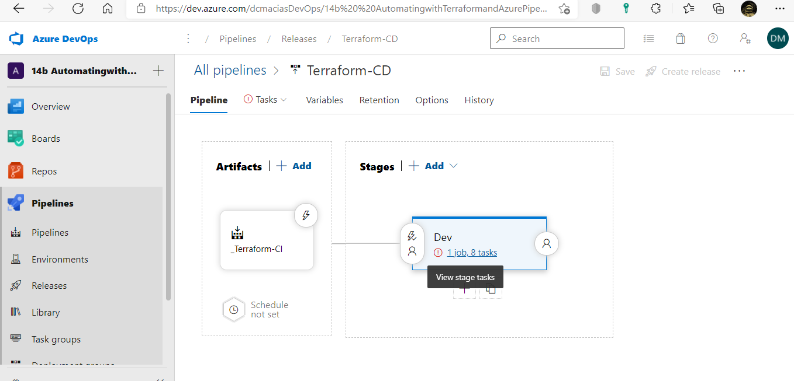

1. In the list of tasks of the **Dev** stage, select the **Azure CLI to deploy required Azure resources** task. 

1. On the **Azure CLI** pane, in the **Azure subscription** dropdown list, select the entry representing your Azure subscription and then click **Authorize** to configure the corresponding service connection. When prompted, sign in using the account with the Owner role in the Azure subscription and the Global Administrator role in the Azure AD tenant associated with the Azure subscription.

   > **Note**: By default, Terraform stores state locally in a file named terraform.tfstate. When working with Terraform in a team, use of a local file makes Terraform usage complicated. Terraform supports a remote data store, that facilitates state sharing. In this case, we are using the **Azure CLI** task to create an Azure storage account and a blob container to store Terraform state. For more information regarding Terraform remote state, refer to [Terraform documentation](https://www.terraform.io/docs/state/remote.html)

   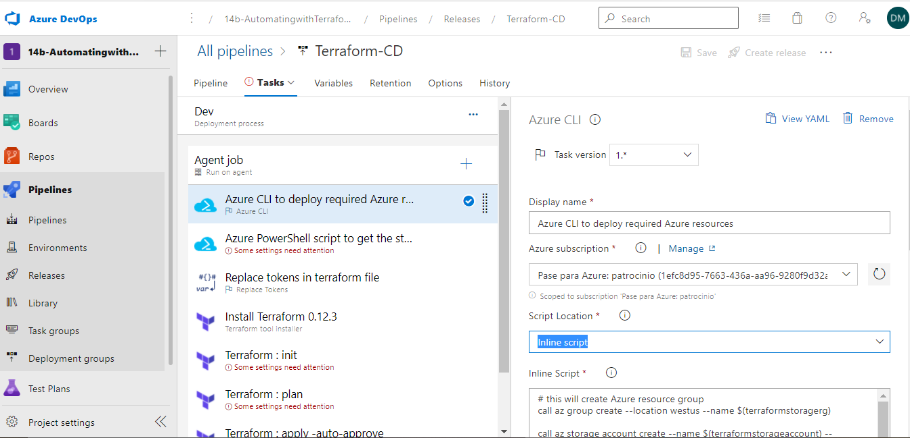

1. In the list of tasks of the **Dev** stage, select the **Azure PowerShell** task. 

1. On the **Azure PowerShell** pane, in the **Azure Connection Type** dropdown list, select **Azure Resource Manager** and then, in the **Azure Subscription** dropdown list, select the newly created Azure service connection (the one under "Available Azure Service Connection").

   > **Note**: To configure the Terraform [backend](https://www.terraform.io/docs/backends/), we need the access key to the Azure Storage account hosting the Terraform state. In this case, we are using Azure PowerShell task to retrieve the access key of the Azure Storage account provisioned in the previous task. By using `Write-Host "##vso[task.setvariable variable=storagekey]$key"` we are creating a pipeline variable that we will be able to use on later tasks.

   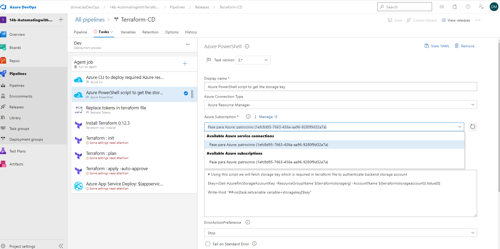

1.  In the list of tasks of the **Dev** stage, select the **Replace tokens in Terraform file** task.

    > **Note**: If you carefully reviewed the **webapp.tf** file, you should have noticed a few values suffixed and prefixed with **__**, such as `__terraformstorageaccount__`. The **Replace Tokens** task will replace those values with the variable values defined in the release pipeline.
    
1. Terraform tool installer task is used to install  a specified version of Terraform from the Internet or the tools cache and prepends it to the PATH of the Azure Pipelines Agent (hosted or private).

1.  In the list of tasks of the **Dev** stage, select and review the **Install Terraform** task. This task installs the Terraform version you designate.

    > **Note**: The When running Terraform in automation, the focus is usually on the core plan/apply cycle, which consists of the following three stages:

    1.  Initializing the Terraform working directory.
    1.  Producing a plan for modifying current configuration to match the desired configuration.
    1.  Applying the changes determined during the planning stage.
    
    > **Note**: The remaining Terraform tasks in the release pipeline implement this workflow.

1. In the list of tasks of the **Dev** stage, select the **Terraform: init** task. 

1. On the **Terraform** pane, in the **Azure subscription** dropdown list, select the same Azure service connection you used previously. 

1. On the **Terraform** pane, in the **Container** dropdown list, type **terraform** and ensure that the **Key** parameter is set to **terraform.tfstate**. 

   > **Note**: The `terraform init` command parses all of the *.tf files in the current working directory and automatically downloads any of the providers required to process them. In this example, it will download the [Azure provider](https://www.terraform.io/docs/providers/azurerm/), since we are deploying Azure resources. For more information about `terraform init` command, refer to [Terraform documentation](https://www.terraform.io/docs/commands/init.html)

   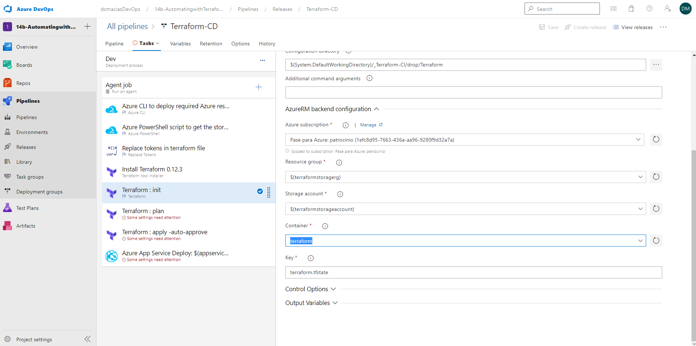

1. In the list of tasks of the **Dev** stage, select the **Terraform: plan** task.

1.  On the **Terraform** pane, in the **Azure subscription** dropdown list, select the same Azure service connection you used previously. 

    > **Note**: The `terraform plan` command is used to create an execution plan. Terraform determines what actions are necessary to achieve the desired state specified in the configuration files. This allows you to review which changes are in scope, without actually having to apply them. For more information about `terraform plan` command, refer to [Terraform documentation](https://www.terraform.io/docs/commands/plan.html)

1. In the list of tasks of the **Dev** stage, select the **Terraform: apply -auto-approve** task. 

1.  On the **Terraform** pane, in the **Azure subscription** dropdown list, select the same Azure service connection you used previously. 

    > **Note**: This task will run the `terraform apply` command to deploy the resources. By default, it would also prompt for a confirmation to proceed. Since we are automating the deployment, the task includes the `auto-approve` parameter that eliminates the need for a confirmation. 

1. In the list of tasks of the **Dev** stage, select the **Azure App Service Deploy** task. Select Azure service connection from the drop-down.

   > **Note**: This task will deploy the PartsUnlimited package to Azure app service, provisioned by the **Terraform: apply -auto-approve** task in the previous step.

   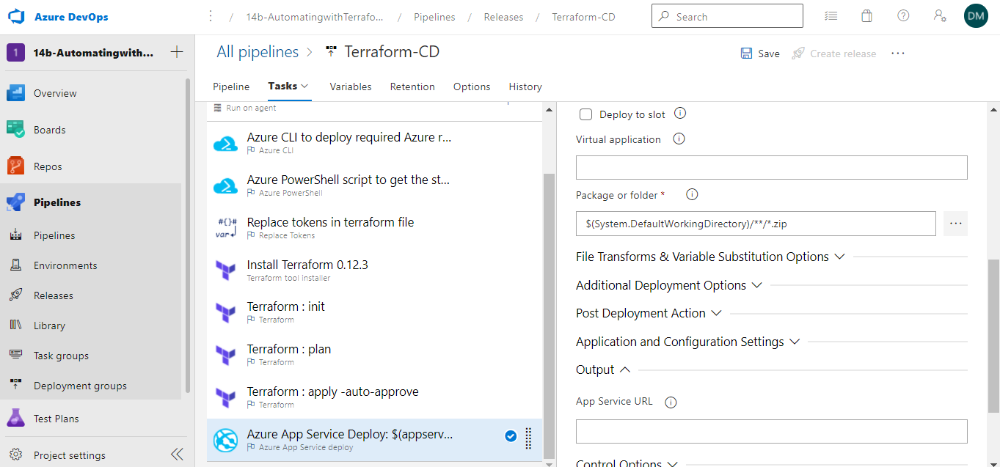

1. On the **Dev** stage, click on **Agent job** and on the Agent pool dropdown list select: **Azure Pipelines > windows-2019**.

   

1. On the **All pipelines > Terraform-CD** pane, click **Save**, in the **Save** dialog box, click **OK**, and, in the upper right corner, click **Create a release**. 

   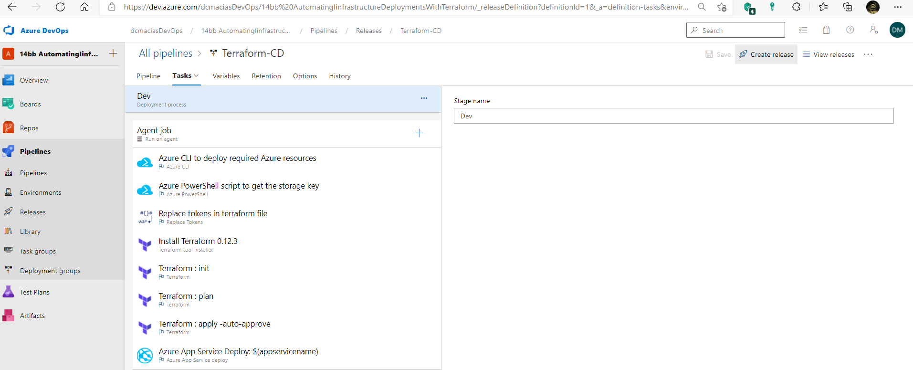

1. On the **Create a new release** pane, in the **Stages for a trigger change from automated to manual** dropdown list, click **Dev**, in the **Artifacts** section, in the **Version** dropdown list, select the entry representing the version of the artifact for this release, and click **Create**.

   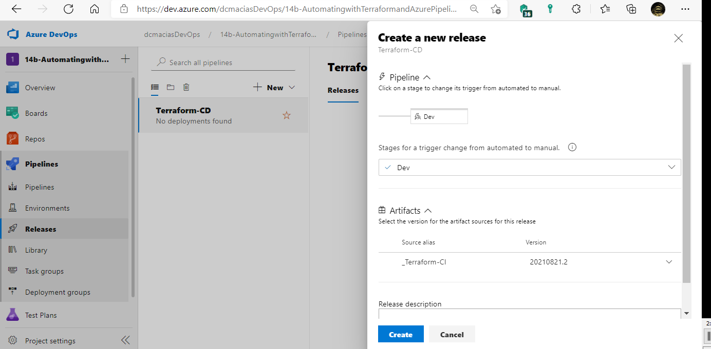

1. In the Azure DevOps portal, navigate back to the **Terraform-CD** pane and click the entry **Release-1** representing the newly created release. 

1. On the **Terraform-CD > Release-1** blade, click the rectangle representing the **Dev** stage, on the **Dev** pane, click **Deploy** and then click **Deploy** again.

   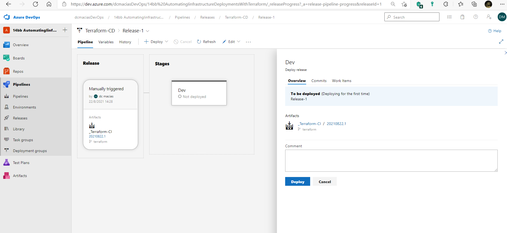

   

1. Back on the On the **Terraform-CD > Release-1** blade, click the rectangle representing the **Dev** stage and monitor the deployment process. 

    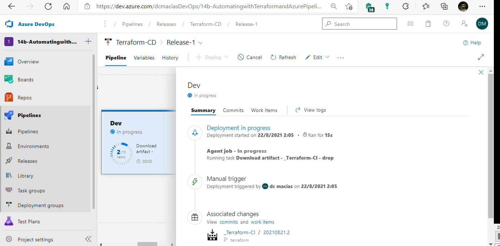

    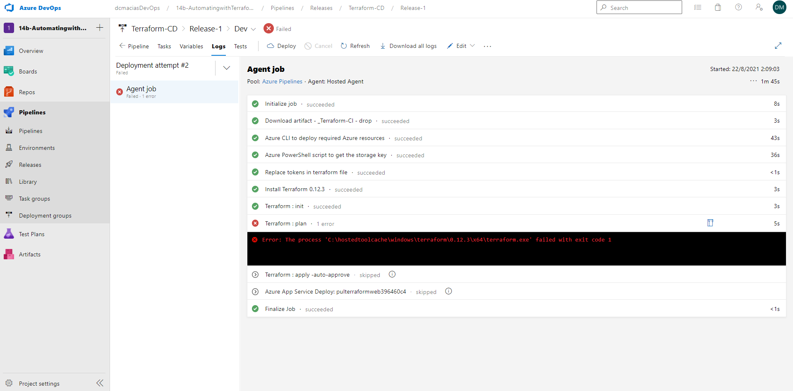

    ```txt
     https://github.com/microsoft/azuredevopslabs/issues/395 
    
     provider "azurerm" {
        features {}
     }
    
     webapp.tf
    ```

    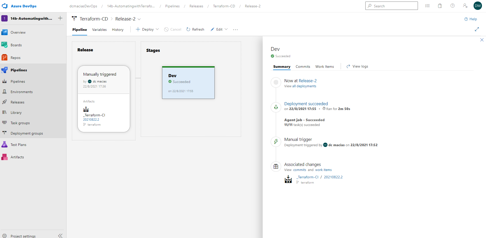

    

1. Once the release successfully completes, on your lab computer, launch another web browser window, navigate to the [**Azure Portal**](https://portal.azure.com), and sign in with the user account that has at least the Contributor role in the Azure subscription you will be using in this lab. 

1. In the Azure portal, search for and select the **App Services** resources and, from the **App Services** blade, navigate to the web app which name starts with **pulterraformweb**. 

   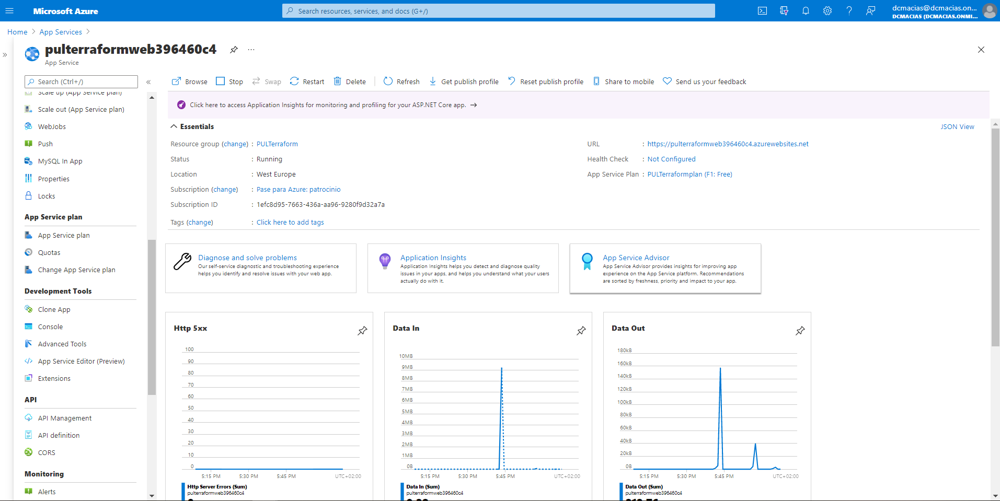

1.  On the web app blade, click **Browse**. This will open another web browser tab, displaying the newly deployed web application.

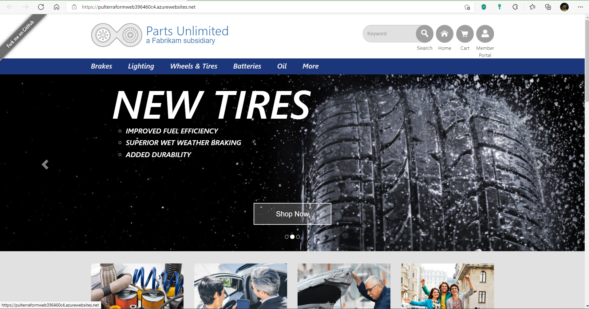

### Exercise 2: Remove the Azure lab resources

In this exercise, you will remove the Azure resources provisioned in this lab to eliminate unexpected charges. 

>**Note**: Remember to remove any newly created Azure resources that you no longer use. Removing unused resources ensures you will not see unexpected charges.

#### Task 1: Remove the Azure lab resources

In this task, you will use Azure Cloud Shell to remove the Azure resources provisioned in this lab to eliminate unnecessary charges. 

1.  In the Azure portal, open the **Bash** shell session within the **Cloud Shell** pane.
1.  List all resource groups created throughout the labs of this module by running the following command:

    ```sh
    az group list --query '[?contains(`["terraformrg", "PULTerraform"]`, name)].name' --output tsv
    ```

1.  Delete all resource groups you created throughout the labs of this module by running the following command:

    ```sh
    az group list --query '[?contains(`["terraformrg", "PULTerraform"]`, name)].name' --output tsv | xargs -L1 bash -c 'az group delete --name $0 --no-wait --yes'
    ```

    >**Note**: The command executes asynchronously (as determined by the --nowait parameter), so while you will be able to run another Azure CLI command immediately afterwards within the same Bash session, it will take a few minutes before the resource groups are actually removed.


## Review

In this lab, you learned how to automate repeatable deployments with Terraform on Azure using Azure Pipelines.
